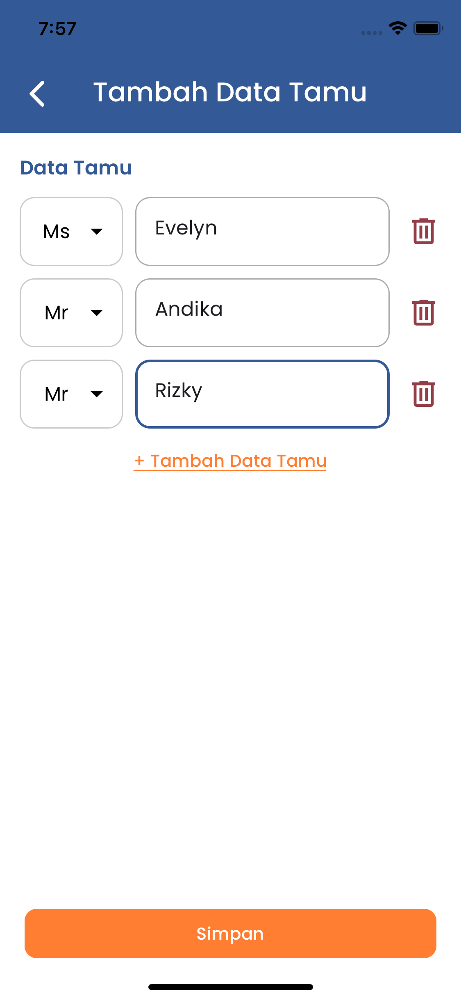

## Booking To Go - React Native App Interview

_By: Rizky Arsyansyah Rinjani_

<br />

### Software Requirement :
- Node JS >= 16.20.2
- Yarn >= 1.22.19 (Optional)


### Step to Run :
1. ```npm install``` or ```yarn```
2. ```npm start``` or ```yarn start```
3. Scan QR Code to preview on iOS or Android device

<br />

|              iOS Page 1              |              iOS Page 2              |
|:------------------------------------:|:------------------------------------:|
|  |  |

<br />

|                Android Page 1                |               Android Page 2                |
|:--------------------------------------------:|:-------------------------------------------:|
|  | |
